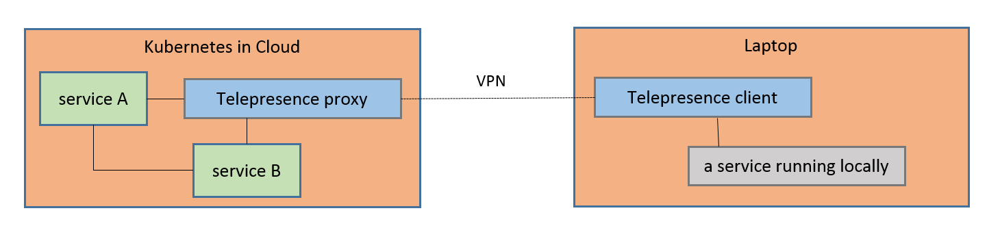

class: center, middle, inverse
### Introduction to Telepresence

---
### whoami

.left-small[
    
]

.right-large[
- Kyohei Mizumoto(@kyohmizu)

- C# Software Engineer

- Interests
    - Docker/Kubernetes
    - Go
    - Security
]
---
### Required Knowledge

- Basic knowledge of kubernetes

### Goals

- Understand:
  
  - the concept of telepresence
  
  - how to test application with Telepresence

---
### Contents

- Overview

  - What is Telepresence?
  
  - Features

- Get Started
  
  - Install Telepresence
  
  - Examples (Demo)

---
class: center, middle, blue
## Overview

---
### What is Telepresence?

.left-large[
<u><https://www.telepresence.io/></u>

Local development against a remote Kubernetes cluster

- OSS hosted by CNCF

  - The Sandbox project

- Enables developers to do fast and easy test/debug of a service

]

.right-small[
<center></center>
]

---
class: header-margin
### CNCF Landscape

.half-3[
<center></center>
]

.zoom0-r[
<u><https://landscape.cncf.io/images/landscape.png></u>
]

---
class: header-margin
### CNCF Landscape

<center></center>

---
### Features

With Telepresence, developers can:

- Deploy a service locally in the same condition as a Kubernetes cluster

- Use any tool installed locally to test/debug/edit a service

- Swap a service running on a cluster for a local service

---
### How it works

<u><https://www.telepresence.io/discussion/how-it-works></u>

Telepresence builds a network-proxy between:

- a custom pod running inside a Kubernetes cluster

- a process running on your development machine

<center></center>

---
class: center, middle, blue
## Get Started

---
### Install Telepresence

<u><https://www.telepresence.io/reference/install></u>

On Ubuntu, run the following:

.zoom2[
```bash
$ curl -s https://packagecloud.io/install/repositories/→
datawireio/telepresence/script.deb.sh | sudo bash
$ sudo apt install --no-install-recommends telepresence

# Verify the Installation
$ telepresence --version
```
]

---
### Quick Start

<u><https://github.com/telepresenceio/telepresence></u>

.zoom2[
```bash
# Verify the connection to the Kubernetes cluster
$ kubectl get no
NAME                     STATUS   ROLES   AGE   VERSION
aks-default-09796230-0   Ready    agent   43h   v1.13.12
aks-default-09796230-1   Ready    agent   43h   v1.13.12

# Start a shell that proxies connections to Kubernetes
# Needs to enter the sudo password
$ telepresence
```
]

---
### Example

.zoom01[
```bash
$ cat hello-world-deploy.yaml
apiVersion: apps/v1
kind: Deployment
metadata:
  labels:
    app: hello-world
  name: hello-world
spec:
  replicas: 1
  selector:
    matchLabels:
      app: hello-world
  template:
    metadata:
      labels:
        app: hello-world
    spec:
      containers:
      - image: datawire/hello-world
        name: hello-world
        ports:
        - containerPort: 8000
```
]

---
### Example

<u><https://www.telepresence.io/tutorials/kubernetes></u>

.zoom1[
```bash
# Deploy a service in the Kubernetes cluster
$ kubectl apply -f hello-world-deploy.yaml
deployment.apps/hello-world created
$ kubectl expose deployment hello-world --type=LoadBalancer \
--port=8000 --target-port=8000 --name=hello-world
service/hello-world exposed

$ kubectl get po | grep hello-world
hello-world-645b769fd4-pxh8l   1/1     Running   0          3m52s

$ kubectl get svc
NAME          TYPE           CLUSTER-IP     EXTERNAL-IP      
PORT(S)          AGE
hello-world   LoadBalancer   10.0.181.195   104.46.217.233   
8000:31793/TCP   4m49s
```
]

---
### Example

.zoom2[
```bash
# Send a query to a service running in the cluster
$ export HELLOWORLD=http://104.46.217.233:8000
$ curl $HELLOWORLD
Hello, world!
```
]

or display in web browser


---
### Example

.zoom2[
```bash
# Set up a development environment
$ mkdir telepresence; cd telepresence
$ echo "hello from your laptop" > file.txt
$ ls
file.txt

# Test locally
$ python3 -m http.server 8001 &
[1] 47404
$ curl http://localhost:8001/file.txt
hello from your laptop
$ kill %1
```
]

---
### Example

.zoom2[
```bash
# Swap the deployment with Telepresence
$ telepresence --swap-deployment hello-world --expose 8000 \
--run python3 -m http.server 8000 &

# A pod is swapped
$ kubectl get po | grep hello-world
hello-world-7c2fc81aaad6400bae6c760f74be47cb-59db7d4c9b-7ll2r
   1/1     Running  0          5m28s

# Send a query to a service
$ curl $HELLOWORLD/file.txt
hello from your laptop
```
]

or display in web browser

---
### Example

.zoom2[
```bash
# Finish swapping
# Kill Telepresence locally
$ fg
^C

# New pod is created
$ kubectl get po | grep hello-world
hello-world-645b769fd4-tvsr6   1/1     Running   0          8s
```
]

---
### Example (Docker)

<u><https://www.telepresence.io/tutorials/docker></u>

.zoom2[
```bash
# Get a sample from GitHub
$ git clone https://github.com/datawire/hello-world
$ cd hello-world
$ ls
Dockerfile  LICENSE  README.md  requirements.txt  server.py
```
]

---
### Example (Docker)

.zoom2[
```bash
# Fix a dependency problem
$ git diff requirements.txt
diff --git a/requirements.txt b/requirements.txt
index a938e09..16b0f08 100644
--- a/requirements.txt
+++ b/requirements.txt
@@ -3,4 +3,4 @@ Flask==1.0.2
 itsdangerous==1.1.0
 Jinja2==2.10
 MarkupSafe==1.1.1
-Werkzeug==0.15.2
+Werkzeug==0.15.6

# Build a docker image
$ sudo docker build -t hello-dev .
```
]

---
### Example (Docker)

.zoom2[
```bash
$ sudo docker image ls | grep hello-dev
hello-dev      latest     4ef6bfec0bdb     2 hours ago    122MB

# Swap a service for a docker container running locally
$ telepresence --swap-deployment hello-world --docker-run \
--rm -it -v $(pwd):/usr/src/app hello-dev

$ curl http://104.46.217.233:8000
Hello, world!

# Modify server.py
$ sed -i.bak -e s/Hello/Greetings/ server.py

$ curl http://104.46.217.233:8000
Greetings, world!
```
]

---
### Example (Docker)

.zoom01[
```bash
# 2 docker containers are running locally
$ sudo docker container ls
CONTAINER ID        IMAGE                               COMMAND               
  CREATED             STATUS              PORTS                        
    NAMES
e9fc5e0f7ddc        hello-dev                           "python3 ./server.py" 
  8 minutes ago       Up 8 minutes                                     
    telepresence-1573198861-6937146-39240
1851864adb52        datawire/telepresence-local:0.103   "/sbin/tini -v -- py…"
  8 minutes ago       Up 8 minutes        127.0.0.1:41695->38022/tcp   
    telepresence-1573198854-7027166-39240
```
]

---
### Links

.zoom2[
Official  
<u><https://www.telepresence.io/></u>

Docs  
<u><https://www.telepresence.io/discussion/overview/></u>

GitHub  
<u><https://github.com/telepresenceio/telepresence></u>

Book  
<u><https://ktdkt.booth.pm/items/1574892></u>
]

---
class: center, middle, blue
## Thank you!
